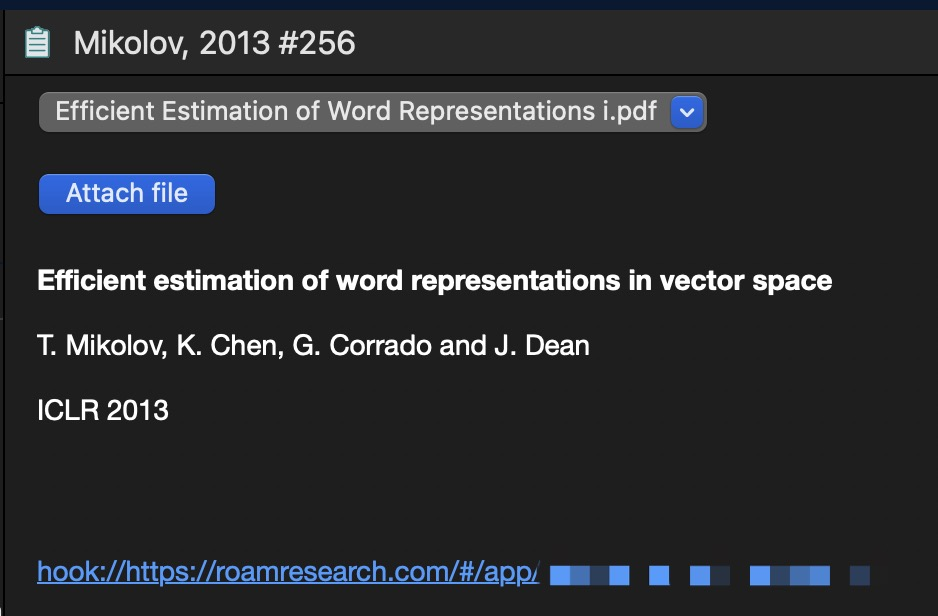

# roam-hook
用 [hook](https://hookproductivity.com) 实现点击roam research网址直接在已打开的roam research网页(chrome)中打开.

说明: 打开 hook 设置, 将 [hook.scpt](hook.scpt) 中的内容拷贝到脚本, 如下图:

然后就可以直接打开链接如: hook://https/roamresearch.com/#/app/...

比如可以在endnote中直接点击进入对应的roam笔记:

脚本写法参考了: https://github.com/jacrify/RoamPageSearch/blob/master/RoamAPI.scpt
