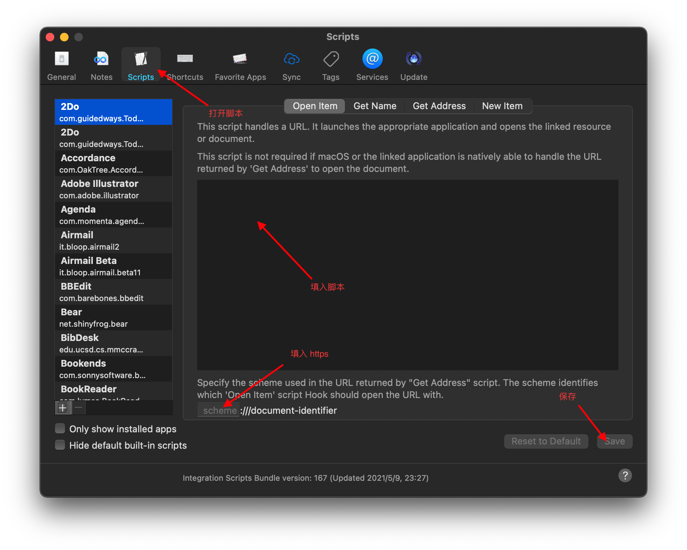

# roam-hook
用hook实现点击roam research网址直接在已打开的roam research网页中打开.

说明: 打开 hook 设置, 将 hook.scpt 中的内容拷贝到脚本, 如下图:

然后就可以直接打开链接如: hook://https://roamresearch.com/#/app/...

脚本写法参考了: https://github.com/jacrify/RoamPageSearch/blob/master/RoamAPI.scpt
